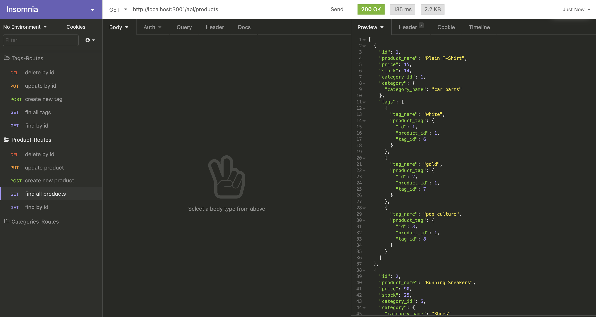
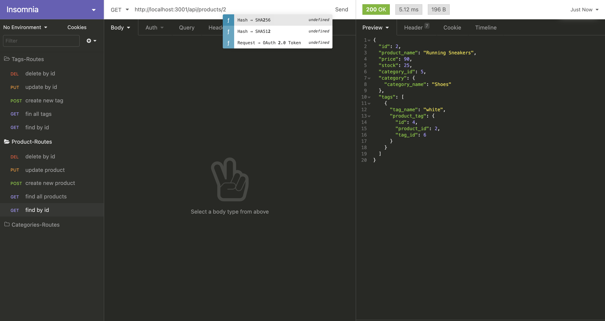
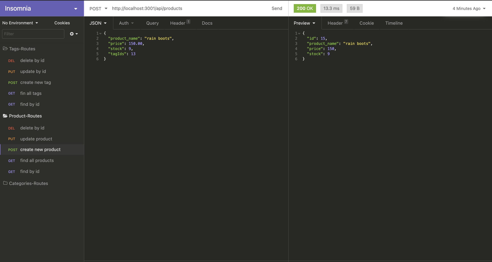
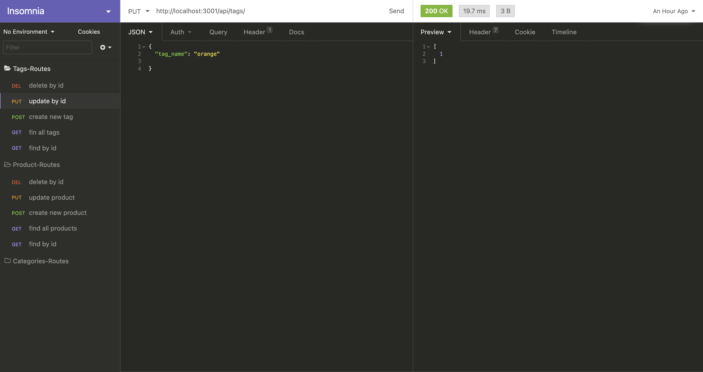

  ### Ecommerce-Back-End 
  
  ## Description
  My e-commerce website that uses the latest technologies so that my company can compete with other e-commerce companies.
  ##  Table of Contents
  * [Installation](#installation)
  * [Usage](#usage)
  * [License](#License)
  * [Contributing](#contributing)
  * [Tests](#Tests)
  * [Questions](#questions)
  
  ## Usage
  In order to run this application, This application used multiple packages like Express, MySQL2, Sequelize, and dotENV.
  
  
  # License
  This project is  licensed MIT license.
  
  ## Contributing
  Contributors: 
  - Alex Reveles
  ## Test
  The following is needed to run the application, install npm packages as described in the Usage section, and must login in to MySQL, run commands "source schema.sql, then Exit. Start the server by simply running the command "node server.js" and test in the application Insomnia Core, doing simple GET, PUT, POST, DELETE request. 
  ## Questions
  If you have any questions regarding about the application, please contact me VIA email alexreveles@yahoo.com
  Thank You!
#### 
#### https://youtu.be/98m3ULhn1gA
#### https://github.com/alexreveles

